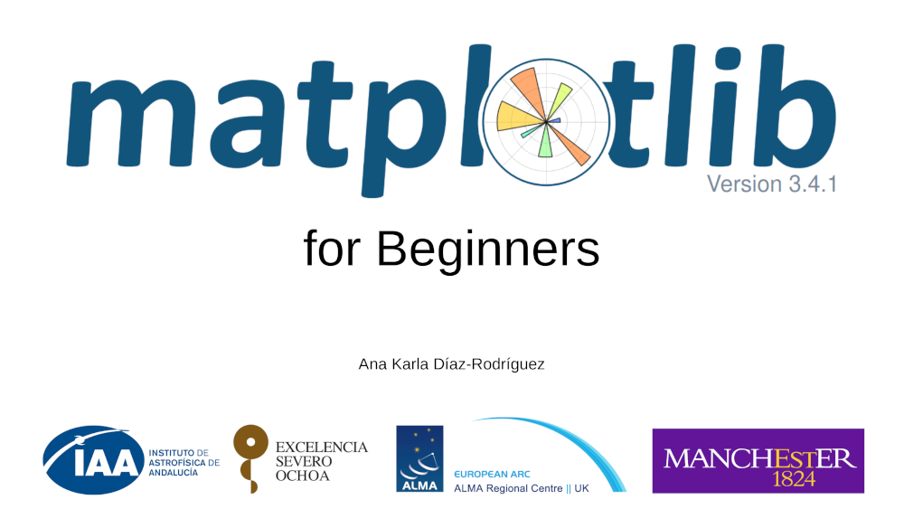

**URL:** [akdiaz.xyz/matplotlib](http://akdiaz.xyz/matplotlib)

Files used in my 'Matplotlib for Beginners' workshop given at the [Institute of Astrophysics of Andalusia](https://www.iaa.csic.es/en) (April 7, 2021).

**Contact me to teach the Workshop at your Institute/School!**

In this 4h course, I will introduce you to Matplotlib, a library for creating visualizations in Python. You will learn how to create, customize and save scientific plots. We will do several exercises to learn how to make Matplotlib fully meet our scientific needs, producing ready-to-be-published plots. We will connect via Zoom. During the first part of the course, we will do the exercises together following a Google Colaboratory notebook that will be shared in advance. During the second half, participants will work in small groups and will share their work with the whole audience.

Click below to open the tutorial notebook.

Click below to open the notebook with solutions.

